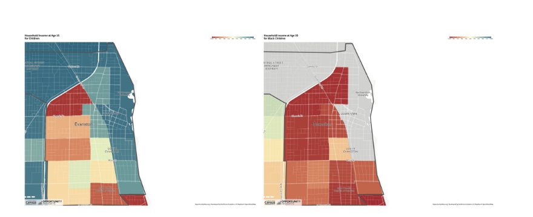
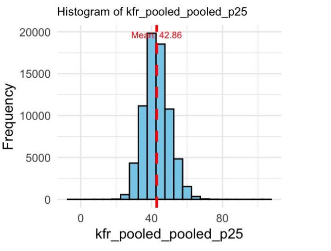

# ECON 50: Using Big Data to Solve Economic and Social Problems - Harvard University

## Project Overview

The project focuses on analyzing upward mobility in Evanston, IL, using data from the Opportunity Atlas and other socioeconomic datasets. The goal was to explore the factors influencing economic mobility, including education, housing costs, public spaces, and proximity to crime. Through detailed exploratory analysis, I uncovered spatial disparities in mobility across census tracts, followed by causal analysis using advanced techniques like **synthetic control methods**, **propensity score matching**, and **difference-in-differences**. These methods allowed me to isolate the effects of Northwestern University, public amenities, and crime on upward mobility, providing robust insights into the social and economic drivers of inequality.

### **Project Part 1: Exploratory Data Analysis**

#### **Problem Statement**
For Project Part 1, I explored **Evanston, IL**, using data from the Opportunity Atlas. The primary goal was to analyze the relationship between upward mobility and several socioeconomic factors, such as rent, race, and education. Specifically, I sought to answer how well Evanston, known for being home to Northwestern University, promotes upward mobility for children from lower-income households compared to other regions in the U.S. My goal was to explore whether economic mobility is more accessible in this area and to identify potential barriers to achieving it.

#### **Methodology**
1. **Data Source**: The primary data source was the Opportunity Atlas dataset, which includes economic mobility data by census tract, racial demographics, education levels, and rental costs.

2. **Exploratory Data Analysis (EDA)**: The project started with a comprehensive data exploration process:
   - **Histograms** and **box plots** helped visualize the distribution of key variables like rent and upward mobility.
   - **Correlation analysis** identified relationships between variables, such as the strong positive correlation between educational attainment and economic mobility.
   - **Spatial Analysis**: I visualized spatial variation in economic mobility using census tracts. The **geographical heatmaps** allowed me to identify neighborhoods with significantly lower upward mobility, highlighting disparities even within the relatively affluent Evanston area.
   

3. **Key Variables**:
   - **kfr_pooled_pooled_p25**: Represents upward mobility measured at the 25th income percentile.
   - **rent_twobed2015**: Median rent for a two-bedroom apartment, which served as a proxy for housing affordability and neighborhood quality.
   - **education_college_pct**: Percentage of the population with at least a college degree.

#### **Approach**
The analysis was structured around a set of research questions:
1. **How does rent affect economic mobility in Evanston?**
   I explored how neighborhoods with higher rents relate to better economic outcomes for children. I hypothesized that higher-rent neighborhoods, typically linked to better public services and schools, would show higher economic mobility.

2. **Does education level influence upward mobility in Evanston?**
   I investigated whether census tracts with a higher percentage of college-educated residents also saw higher mobility outcomes, hypothesizing a positive relationship between higher education and economic mobility.

3. **Are there racial disparities in mobility?**
   Evanston is racially diverse, so I wanted to explore whether racial composition impacted economic outcomes. This was particularly relevant when controlling for socioeconomic variables.

4. **Correlation Between Mobility and Housing Affordability**:
   I used **scatter plots** and **binned scatter plots** to visualize the relationship between rent levels and upward mobility, including linear regression lines to quantify this relationship. Additionally, I overlaid **heatmaps** to visualize these factors geographically.

#### **Techniques**
- **Linear Regression**: To quantify relationships between variables such as education and upward mobility.
- **Correlation Coefficients**: Used to test the strength of relationships between rent, education, and mobility.
- **Geospatial Analysis**: I visualized disparities between census tracts using geographical maps, highlighting where upward mobility is higher or lower.
- **Data Cleaning and Transformation**: Outliers and missing data were handled using imputation and normalization techniques.

#### **Findings**
- **Weak Relationship Between Rent and Mobility**: Contrary to my hypothesis, there was no strong positive correlation between higher rent and upward mobility. The scatter plots showed that high-rent neighborhoods did not necessarily lead to higher income levels for children from lower-income households.
- **Education as a Strong Predictor of Mobility**: The analysis showed a significant positive correlation between the percentage of college-educated residents and upward mobility, which was expected due to the high educational attainment associated with Northwestern University’s proximity.
- **Racial Disparities Persist**: The data revealed that census tracts with a higher Black population had lower upward mobility outcomes, indicating potential barriers beyond just economic factors.
- **Spatial Disparities**: Geographic heatmaps revealed significant disparities in economic mobility even within Evanston, where neighborhoods closer to Northwestern University had significantly better outcomes than those further away.

---

### **Project Part 2: Causal Analysis and Hypothesis Testing**

#### **Problem Statement**
Building on Project Part 1, the second part focused on identifying causal relationships between upward mobility and various social, educational, and environmental factors. Specifically, I aimed to quantify the impact of proximity to educational institutions like Northwestern University, the availability of public spaces, and proximity to high-crime areas (such as nearby Chicago) on economic outcomes.

#### **Methodology**
1. **Data Sources**: I utilized the same Opportunity Atlas dataset but extended the analysis by incorporating additional data on crime rates, public spaces (measured through vegetation proxies), and education levels.
2. **Regression Analysis**: To control for multiple factors simultaneously, I used multiple regression models to isolate the effects of education, public spaces, and crime on economic mobility.
3. **Difference-in-Differences (DiD)**: This method allowed me to assess the impact of neighborhood characteristics, such as crime rates and proximity to educational institutions, on mobility by comparing changes in neighborhoods that were exposed to these conditions to those that were not.
4. **Synthetic Control Method**: I implemented this method to compare neighborhoods affected by Northwestern University’s presence with synthetic neighborhoods that had similar initial conditions but were not near a university. This allowed me to estimate the causal effect of university proximity on mobility.

#### **Approach**
I developed three key hypotheses based on initial findings:
1. **The University Effect**: Neighborhoods closer to Northwestern University would see significantly higher upward mobility due to access to educational resources, better schools, and professional networks.
2. **Public Spaces and Health**: Access to public spaces, measured through vegetation and park data, would positively impact mobility by promoting community health, cohesion, and better mental and physical well-being.
3. **Crime Proximity Impact**: Proximity to high-crime areas, particularly neighboring Chicago, would negatively affect mobility outcomes in Evanston by increasing stress, reducing economic opportunities, and undermining community safety.

#### **Techniques**
- **Synthetic Control Method**: This quasi-experimental design compared upward mobility in Evanston census tracts near Northwestern University with synthetic tracts, controlling for factors like income, race, and education levels. This allowed me to isolate the university’s effect on mobility.
- **Difference-in-Differences (DiD)**: By comparing changes in economic outcomes before and after the growth of public spaces in certain tracts, I assessed whether access to public amenities led to higher mobility.
- **Propensity Score Matching (PSM)**: To reduce bias in estimating the impact of proximity to crime, I used propensity score matching to compare neighborhoods with similar socio-economic profiles but different crime levels.

#### **Findings**
- **The University’s Positive Impact**: The proximity to Northwestern University had a measurable positive impact on upward mobility. Children in neighborhoods closer to the university consistently had higher mobility outcomes, likely due to better access to educational resources and professional networks. The synthetic control method confirmed this finding, showing a significant divergence in mobility trends between university-proximate tracts and synthetic controls.
- **Public Spaces and Health**: My analysis indicated that the availability of public spaces, as measured by vegetation, was positively correlated with economic mobility, though the effect size was smaller than initially hypothesized. While the health benefits of public spaces were evident, their impact on economic mobility was moderated by other factors, such as crime rates and housing costs.
- **Crime's Negative Influence**: Proximity to Chicago’s high-crime neighborhoods had a strong negative effect on upward mobility. Higher male incarceration rates in these areas were associated with reduced mobility, supporting my hypothesis that exposure to crime limits economic opportunities and disrupts social structures necessary for economic advancement.

---

## Technologies Used

- **Programming Languages**: R, Stata
- **Key Libraries**: `tidyverse`, `randomForest`, `ggplot2`
- **Advanced Techniques**: **Synthetic Control Method**, **Propensity Score Matching**, **Difference-in-Differences (DiD)**
- **Datasets**: Opportunity Atlas, health and mobility datasets, crime statistics, vegetation data

## Contact Information

For any questions or comments regarding this repository, please feel free to contact [Shreya Chaturvedi](mailto:your-email@example.com).
